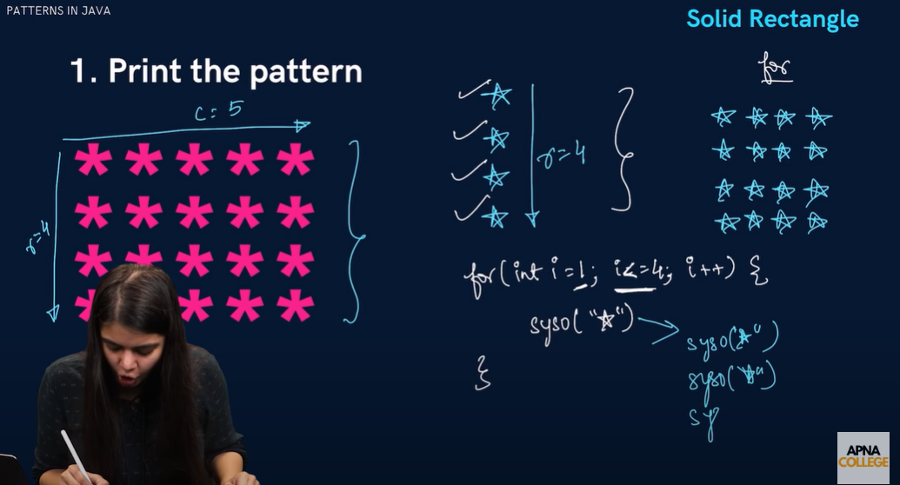
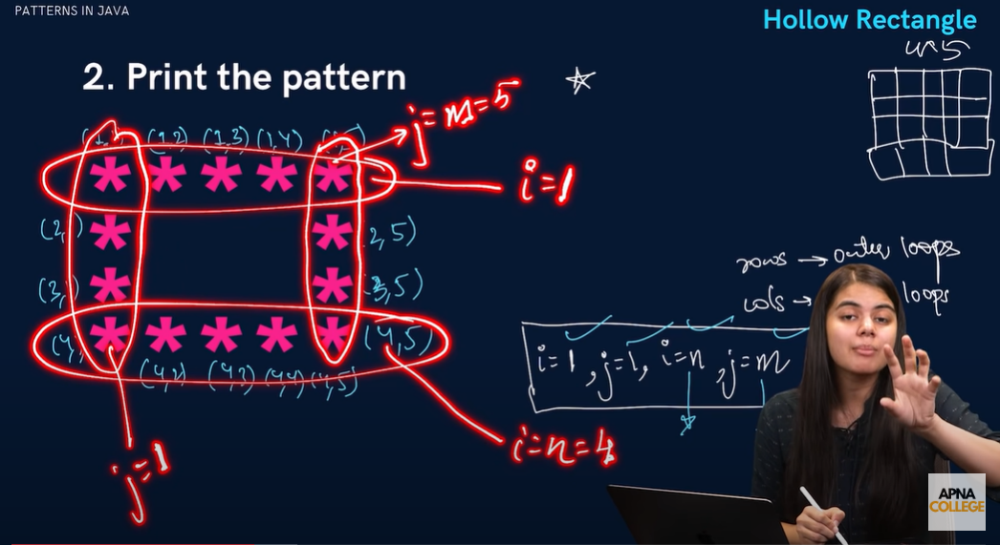
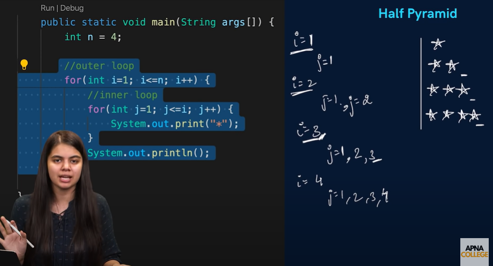
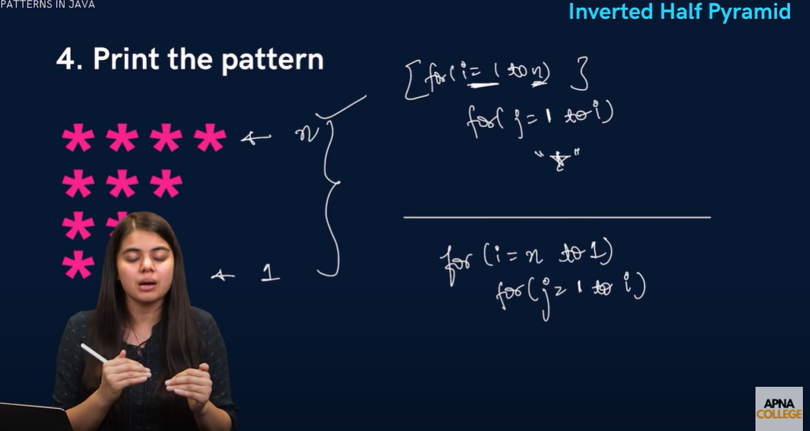
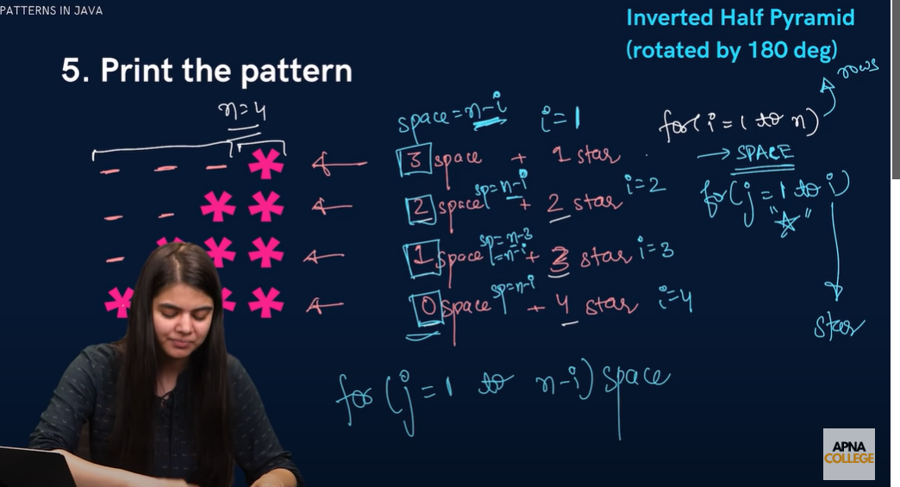
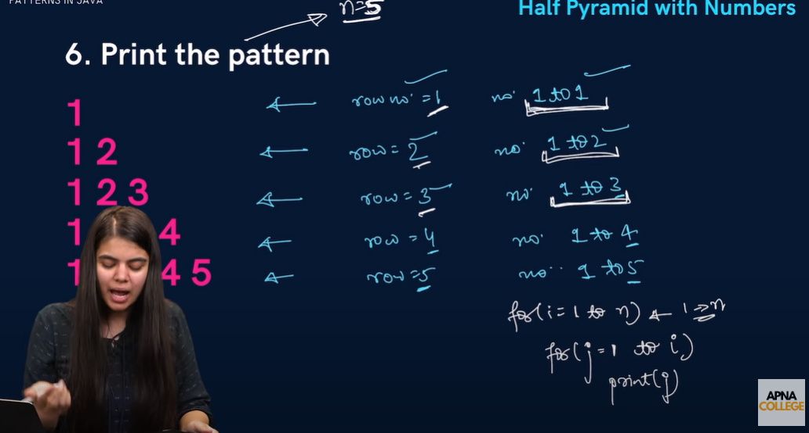
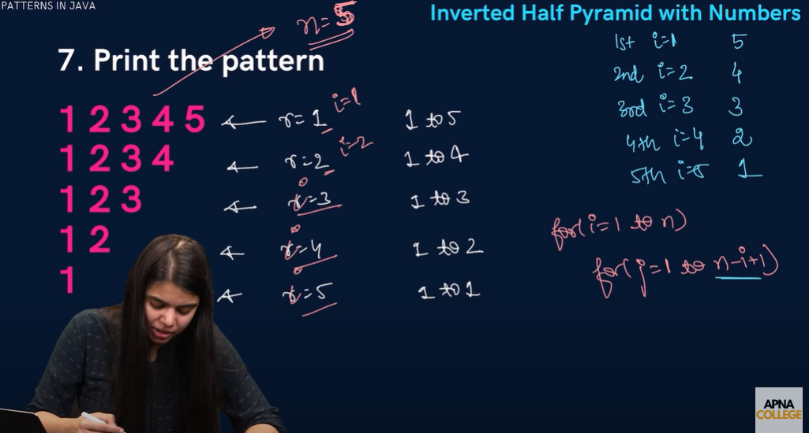
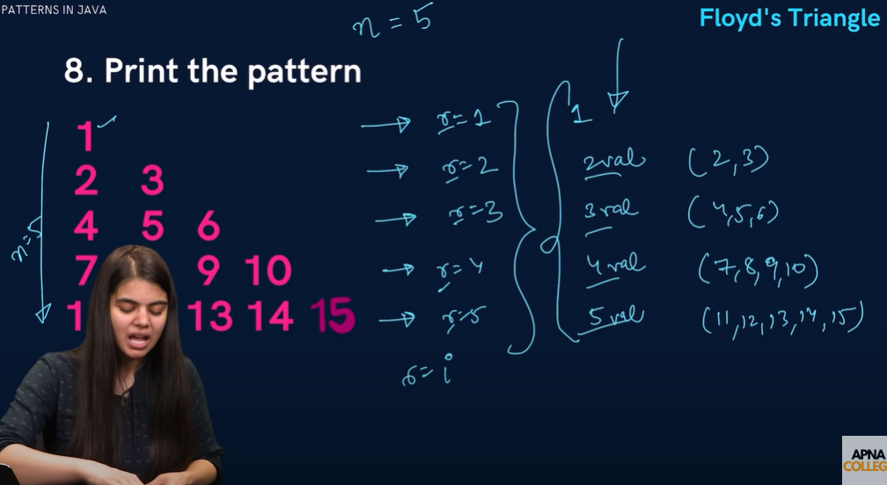
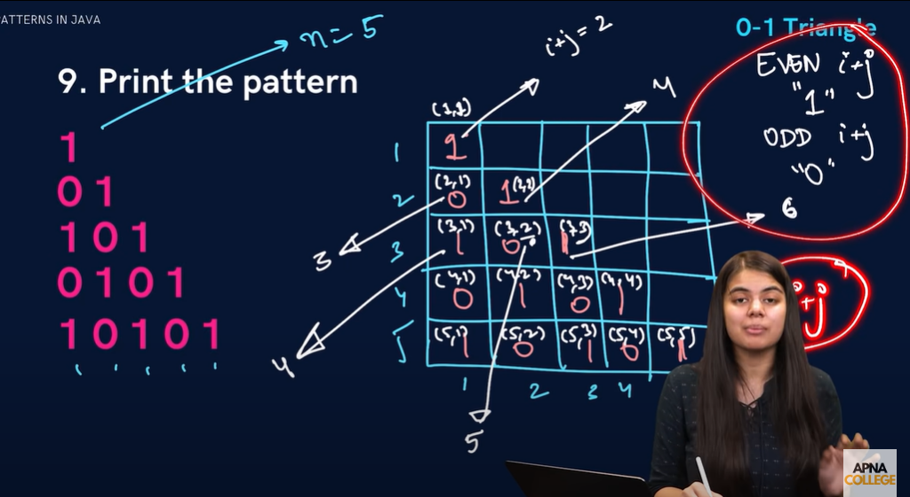

# PATTERN QUESTION :-



# Rows : - outer loops 
# Column : - inner loops


```package _05_Pattern;

public class Pattern_prob {
  public static void main(String[] args) {

    int n = 4;
    int m = 5;

    for (int i = 1; i <= n; i++) {
      for (int j = 1; j <= m; j++) {
        System.out.print("*");
      }
      System.out.println("");
    }
  }
}
```




```package _05_Pattern;

public class Pattern_prob {
  public static void main(String[] args) {

    int n = 4;
    int m = 5;

    for (int i = 1; i <= 4; i++) {
      for (int j = 1; j <= 5; j++) {
        if (i == 1 || j == 1 || i == n || j == m) {
          System.out.print("*");
        } else {
          System.out.print(" ");
        }
      }
      System.out.println();
    }

  }
}
```



```package _05_Pattern;

public class Pattern_prob {
  public static void main(String[] args) {

    int n = 4;

    for (int i = 1; i <= n; i++) {
      for (int j = 1; j <= i; j++) {
        System.out.print("*");
      }
      System.out.println();
    }

  }
}
```




```package _05_Pattern;

public class Pattern_prob {
  public static void main(String[] args) {

    int n = 4;

    for (int i = n; i >= 1; i--) {
      for (int j = 1; j <= i; j++) {
        System.out.print("*");
      }
      System.out.println();
    }

  }
}
```




```package _05_Pattern;

public class Pattern_prob {
  public static void main(String[] args) {

    int n = 4;
    // outer loop
    for (int i = 1; i <= n; i++) {
      // inner loop -> space print
      for (int j = 1; j <= n - i; j++) {
        System.out.print(" ");
      }
      // inner loop -> stars print
      for (int k = 1; k <= i; k++) {
        System.out.print("*");
      }
      System.out.println();
    }
  }
}
```




```package _05_Pattern;

public class Pattern_prob {
  public static void main(String[] args) {

    int n = 4;
    // outer loop
    for (int i = 1; i <= n; i++) {
      // inner loop -> space print
      for (int j = 1; j <= i; j++) {
        System.out.print(j);
      }

      System.out.println();
    }
  }
}
```



```package _05_Pattern;

public class Pattern_prob {
  public static void main(String[] args) {

    int n = 5;
    // outer loop

    for (int i = 1; i <= n; i++) {
      for (int j = 1; j <= n - i + 1; j++) {
        System.out.print(j);
      }
      System.out.println();
    }
  }
}
```



```package _05_Pattern;

public class Pattern_prob {
  public static void main(String[] args) {

    int n = 5;
    int number = 1;
    // outer loop

    for (int i = 1; i <= n; i++) {
      for (int j = 1; j <= i; j++) {
        System.out.print(number);
        number++;
      }
      System.out.println();
    }
  }
}
```





```package _05_Pattern;

public class Pattern_prob {
  public static void main(String[] args) {

    int n = 5;
   
    // outer loop
    for (int i = 1; i <= n; i++) {
      for (int j = 1; j <= i; j++) {
        int sum = i + j;

        if (sum % 2 == 0) {
          System.out.print(" 1 ");
        } else {
          System.out.print(" 0 ");
        }
      }
      System.out.println();
    }
  }
}
```
