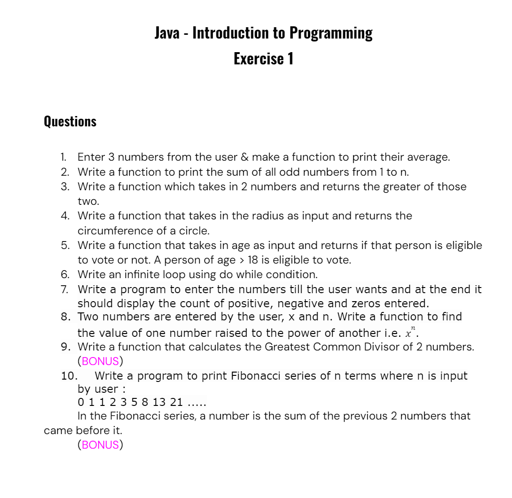

# Function exercise 

## write a java code for printName  using function

```package _07_Function;

import java.util.Scanner;

public class Function {

  public static void printName(String name) {
    System.out.println(name);
    return;
  }

  public static void main(String[] args) {
    System.out.println("enter name :");
    Scanner sc = new Scanner(System.in);
    String name = sc.nextLine();

    printName(name);
  }
}
```

## make a function to add 2 numbers and return the sum 

```package _07_Function;

import java.util.Scanner;

public class Function {

  public static int addTwoNumber(int a, int b) {
    int sum = a + b;
    return sum;
  }

  public static void main(String[] args) {
    System.out.println("enter two number :");

    Scanner sc = new Scanner(System.in);
    int a = sc.nextInt();
    int b = sc.nextInt();

    int result = addTwoNumber(a, b);
    System.out.println(result);
  }
}
```

## find the factorial of a number

```package _07_Function;

import java.util.Scanner;

public class Function {

  public static void main(String[] args) {

    System.out.println("enter number which you want to print factorial");
    Scanner sc = new Scanner(System.in);

    int num = sc.nextInt();
    int fact = 1;
    for (int i = 1; i <= num; i++) {
      fact = fact * i;
    }
    System.out.println("factorial is " + fact);
  }
}

```

## Make a function to check if a number is prime or not.

```
package _07_Function;

import java.util.Scanner;

public class Function {

  public static int printPrime(int num) {
    int count = 0;
    for (int i = 1; i <= num; i++) {
      if (num % i == 0) {
        count++;
      }
    }
    return count;
  }

  public static void main(String[] args) {
    System.out.println("enter number :");
    Scanner sc = new Scanner(System.in);

    int num = sc.nextInt();
    int count = printPrime(num);
    if (count == 2) {
      System.out.println("it is  a prime number :");
    } else {
      System.out.println("it is  not a prime number ");
    }

  }
}
```

## Make a function to check if a given number n is even or not.

```package _07_Function;

import java.util.Scanner;

public class Function {

  public static void evenOdd(int num) {
    if (num % 2 == 0) {
      System.out.println("it is even number ");
    } else {
      System.out.println("it is odd number ");
    }
  }

  public static void main(String[] args) {
    System.out.println("enter number :");
    Scanner sc = new Scanner(System.in);

    int num = sc.nextInt();

    evenOdd(num);
  }
}

```

## Make a function to print the table of a given number n.

```package _07_Function;

import java.util.Scanner;

public class Function {

  public static void tablePrint(int num) {
    for (int i = 1; i <= 10; i++) {
      System.out.println(num + " * " + i + " = " + num * i);
    }
  }

  public static void main(String[] args) {
    System.out.println("enter number :");
    Scanner sc = new Scanner(System.in);

    int num = sc.nextInt();

    tablePrint(num);

  }
}
```





```
#1

package _07_Function;

import java.util.Scanner;

public class Function {

  public static void main(String[] args) {
    System.out.println("enter three number :");
    Scanner sc = new Scanner(System.in);

    int num1 = sc.nextInt();
    int num2 = sc.nextInt();
    int num3 = sc.nextInt();

    int average = (num1 + num2 + num3) / 3;

    System.out.println("average is : " + average);

  }
}
```


```
# 2 

package _07_Function;

import java.util.Scanner;

public class Function {

  public static int sumOdd(int num) {
    int sum = 0;
    for (int i = 1; i <= num; i++) {
      if (i % 2 == 1) {
        sum = sum + i;
      }
    }
    return sum;
  }

  public static void main(String[] args) {
    System.out.println("enter n  number :");
    Scanner sc = new Scanner(System.in);

    int num = sc.nextInt();

    int sum = sumOdd(num);

    System.out.println(sum);
  }
}
```


```
#3

package _07_Function;

import java.util.Scanner;

public class Function {

  public static int greatest(int num1, int num2) {
    if (num1 > num2) {
      return num1;
    } else {
      return num2;
    }
  }

  public static void main(String[] args) {
    System.out.println("enter two  number :");
    Scanner sc = new Scanner(System.in);

    int num1 = sc.nextInt();
    int num2 = sc.nextInt();

    int greater = greatest(num1, num2);

    System.out.println(greater);
  }
}
```


```
# 4
package _07_Function;

import java.util.Scanner;

public class Function {

  public static int circumference(int radius) {
    double c = 2 * 3.14 * radius;

    return (int) c;
  }

  public static void main(String[] args) {
    System.out.println("enter radius :");
    Scanner sc = new Scanner(System.in);

    int radius = sc.nextInt();

    int circum = circumference(radius);

    System.out.println(circum);
  }
}
```


```
# 6

package _07_Function;

import java.util.Scanner;

public class Function {

  public static void main(String[] args) {
   
    int i = 1;
    do {
      System.out.println(i);
      i++;
    } while (i > 1);
  }
}
```


```
# 7
package _07_Function;

import java.util.Scanner;

public class Function {

  public static void main(String[] args) {
    int user;
    int positive = 0;
    int negative = 0;
    int zeros = 0;
    do {
      System.out.println("enter number :");
      Scanner sc = new Scanner(System.in);
      int num = sc.nextInt();
      System.out.println(num);

      System.out.println("enter choice you want to print or not ( 1 or 0 ) :");
      user = sc.nextInt();

      if (num > 0) {
        positive++;

      } else if (num < 0) {
        negative++;
      } else {
        zeros++;
      }

    } while (user != 0);
    System.out.println(positive);
    System.out.println(negative);
    System.out.println(zeros);
  }
}
```

```
# 8

package _07_Function;

import java.util.Scanner;

public class Function {

  public static int calculatePower(int x, int n) {
    int power = (int) Math.pow(x, n);
    return power;
  }

  public static void main(String[] args) {

    System.out.println("enter x and n :");
    Scanner sc = new Scanner(System.in);

    int x = sc.nextInt();
    int n = sc.nextInt();

    int power = calculatePower(x, n);
    System.out.println("power is : " + power);
  }
}```